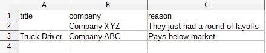
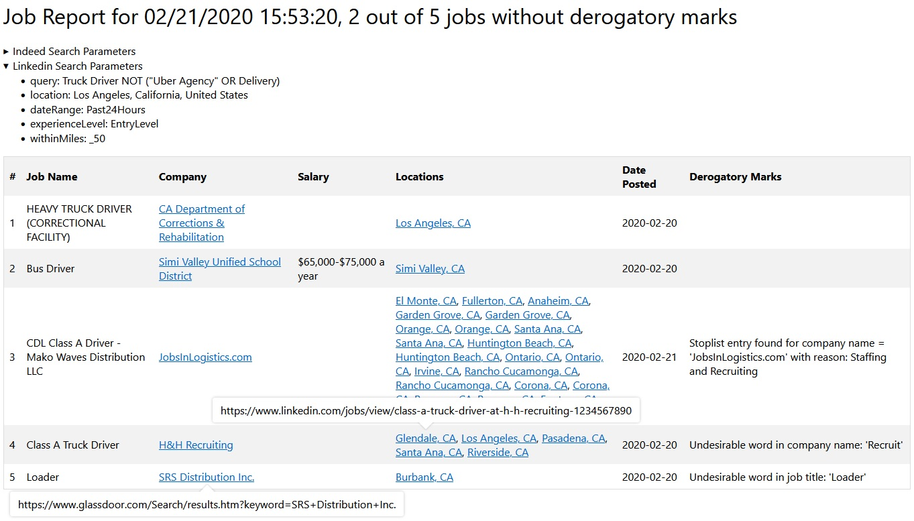
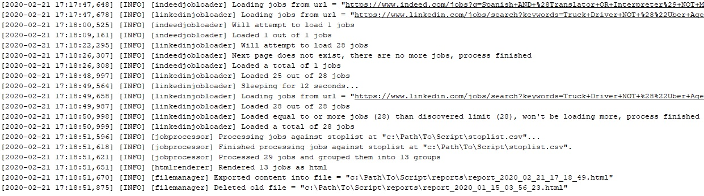

# Job Scraper
Scrapes jobs from Indeed.com and LinkedIn.com websites and produces a unified html report. Written in Python. Uses Selenium and Chrome browser to scrape jobs.

# How to Use
## System Setup
1. Install Python (3.11 and up)
1. Install Selenium module for Python: `python -m pip install selenium`
1. Install Undetected Chromedriver module for Python: `python -m pip install undetected-chromedriver`
1. Install Chrome browser to standard location
1. Check your Chrome browser version and install Chromedriver for your version of Chrome: [https://googlechromelabs.github.io/chrome-for-testing/](https://googlechromelabs.github.io/chrome-for-testing/)
1. Go to [src/constants.py](src/constants.py), find `CHROME_DRIVER_PATH` and provide a path to your Chromedriver installation: `CHROME_DRIVER_PATH = 'C:\Path\To\Your\chromedriver.exe'`
1. If you want to run Chrome with an actual window and see pages it visits, comment out `options.add_argument('--headless=new')` in [main.py](main.py)
1. You are ready to run the script: `python main.py` from the main script folder.

## Edit Code to Suit Your Needs
### Search Parameters
The script can search for jobs based on a number of parameters. Go to [main.py](main.py) and find the following block of code that searches for contract remote jobs posted by employers for an English-Spanish translator:

```
indeedParams = Indeed.SearchParams()
indeedParams.query = 'Spanish AND (Translator OR Interpreter) NOT Medical'
indeedParams.location = 'United States'
indeedParams.dateRange = Indeed.Enums.DateRange.Last7Days
indeedParams.jobType = Indeed.Enums.JobType.Contract
indeedParams.postedBy = Indeed.Enums.PostedBy.Employer
indeedParams.remoteOrTemporarilyRemote = Indeed.Enums.Remote.Remote
```
For the full range of available parameters refer to [src/indeed/searchparams.py](src/indeed/searchparams.py).

Linkedin parameters are very much the same. In the example below we search for an entry level truck driver position within 50 miles from Los Angeles posted not more than 24 hours ago:

```
linkedinParams = Linkedin.SearchParams()
linkedinParams.query = 'Truck Driver NOT ("Uber Agency" OR Delivery)'
linkedinParams.location = 'Los Angeles, California, United States'
linkedinParams.dateRange = Linkedin.Enums.DateRange.Past24Hours
linkedinParams.experienceLevel = Linkedin.Enums.ExperienceLevel.EntryLevel
linkedinParams.withinMiles = Linkedin.Enums.WithinMiles._50
```
For the full range of available parameters refer to [src/linkedin/searchparams.py](src/linkedin/searchparams.py).

The script will try to search Indeed and Linkedin with these parameters and download all jobs that are found, but not more than 500. This number can be changed in [src/constants.py](src/constants.py) by editing `INDEED_JOB_LOADING_LIMIT` and `LINKEDIN_JOB_LOADING_LIMIT`.

For every job, the following information will be available:

* Title
* Company name
* Location
* Job Link
* Posted Date
* Salary (if listed in the ad)

Full job descriptions won't be available.

### Further Filtering
Before jobs make it into the final report, they are grouped and ranked. Grouping is always done by job title and company name. Company XYZ posting 20 separate job ads for a truck driver position will be represented by a single entry with multiple locations in the final report.

Ranking is done by 2 mechanisms:

* Stoplist. Placing a file `stoplist.csv` in the same folder as [main.py](main.py) will cause the script to use it for ranking jobs.
```
root
├── main.py
└── stoplist.csv
```

The file needs to have 3 columns: `title`, `company`, `reason`. `title` and `company` are job title and company name, `reason` is reason for giving the job low weight. `title` OR `company` can be blank (but not both). `reason` can be anything. It will be displayed in the final report as a "derogatory mark" on a job to let you know why a certain job ranked low. For example, you found out that Company XYZ just had a round of layoffs, and there are more to follow, so you want to have this information before your eyes before you apply to their jobs. Or, Company ABC enjoys posting a truck driver job ad every week that you know for a fact pays lower than the market. Here's what you put into `stoplist.csv`:
```
title,company,reason
,Company XYZ,They just had a round of layoffs
Truck Driver,Company ABC,Pays below market
```
`stoplist.csv` being viewed in Excel:



* Keywords. If manually maintaning a stoplist seems too bothersome, there's another way to rank jobs: keywords. Unlike stoplist that can only lower rankings, keywords can either lower or raise them. Go to [main.py](main.py) and find this code:
```
# setup job filtering/weighing after search
weighingConditions = [RegexFilteringWeight(fieldNameToTest = 'title', weight = DEROGATORY_MARK_WEIGHT_HANDICAP, regex = r'diesel|loader'),
                      RegexFilteringWeight(fieldNameToTest = 'company', weight = DEROGATORY_MARK_WEIGHT_HANDICAP, regex = r'recruit|hire|talent|partners'),
                      RegexFilteringWeight(fieldNameToTest = 'title', weight = 2, regex = r'class a|local'),
                      RegexFilteringWeight(fieldNameToTest = 'company', weight = 1, regex = r'department'),
                      SalaryFilteringWeight(weight = 3, salaryMustBeNoLessThan = 80000)]
```
With this, jobs like **Loader** posted by company Great **Recruit**ing will rank lower and receive derogatory marks showing that there were undesirable word in job title and company name, while **Class A** Driver posted by California **Department** of Corrections with salary higher than or equal to $80,000 will rank high.

### Final Report
The script will make a folder named `reports` in the same folder as the main script. There will be up to 10 newest reports (this number can be changed in [src/constants.py](src/constants.py) by editing `KEEP_NEWEST_REPORTS_COUNT`). All earlier reports will be deleted.
```
root
├── reports
│   ├── report_2020_02_02_22_09_21.html
│   └── report_2020_02_03_15_45_03.html
└── main.py

```
A typical report looks like this:



### Logs
The script will make a folder named `logs` in the same folder as the main script. There will be up to 10 newest log files, with a new log file every day. All earlier log files will be deleted. These settings can be changed in [logging.conf](logging.conf).
```
root
├── logs
│   ├── log.txt.2020-02-01
│   ├── log.txt.2020-02-02
│   └── log.txt
├── main.py
└── logging.conf

```
A typical log file looks like this:



### Tests
Unit tests reside in the [test](test) folder. Here's the command for running them from the root folder and intended results:
```
python -m unittest discover -s ./test -p *_test.py
................................
----------------------------------------------------------------------
Ran 36 tests in 3.108s

OK
```
